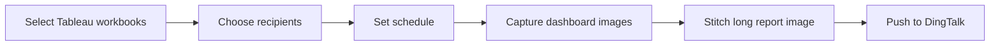
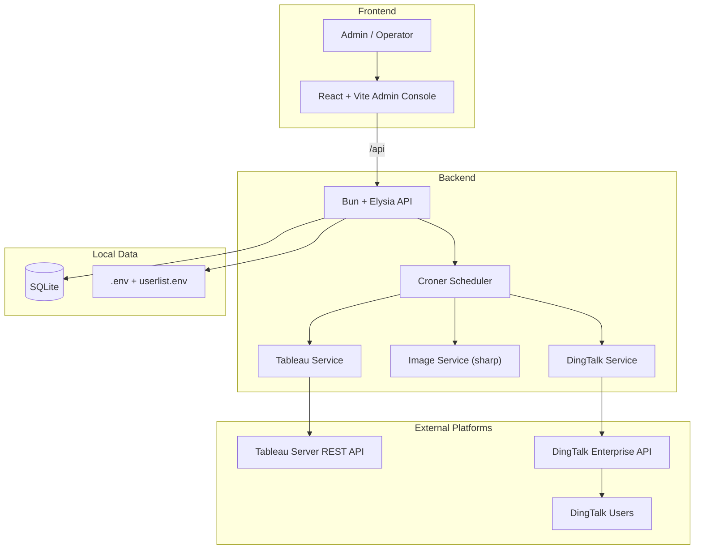
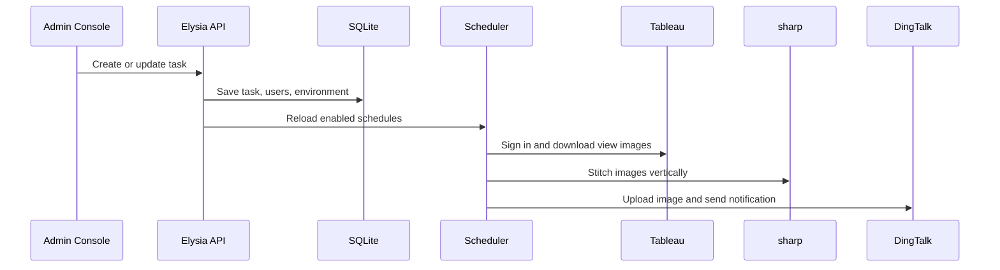
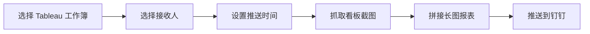
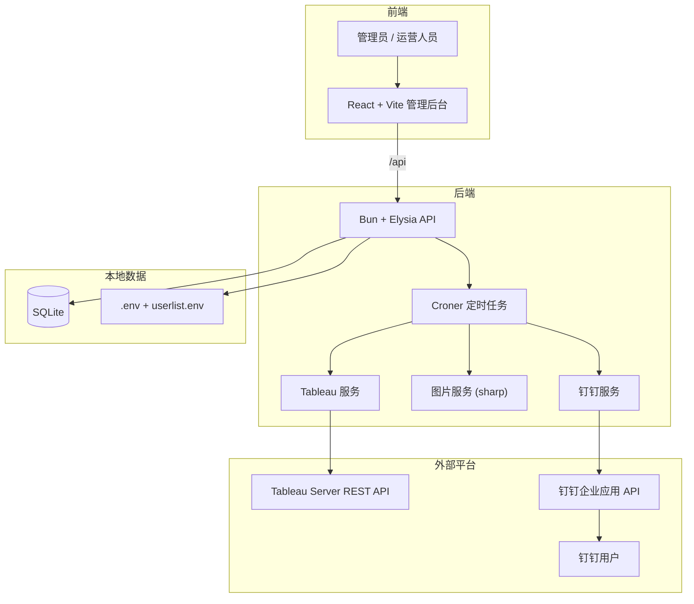
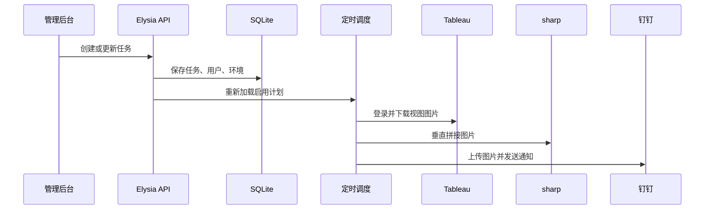

# Tableau Push Ding

**Automate Tableau screenshot delivery to DingTalk with a visual admin console.**


Tableau Push Ding helps teams turn Tableau dashboards into scheduled DingTalk work notifications. Operators use a web console to choose workbooks, recipients, environments, and delivery time; the backend captures Tableau views, stitches them into a readable long image, and sends the report through DingTalk.

[中文速览](#中文速览)

## Demo Story

| Before | After |
| --- | --- |
| Open Tableau every day | Schedule once in the admin console |
| Manually export dashboard screenshots | Backend captures high-resolution Tableau views |
| Combine multiple pages by hand | `sharp` stitches views into one long PNG |
| Send reports to each group manually | DingTalk sends work notifications automatically |
| Easy to mix test and production users | Environments and recipients are separated in SQLite |

## Product Flow



## What You Can Show in a Demo

| Screen / Moment | What to Point Out | Why It Sells |
| --- | --- | --- |
| Login | Simple admin entry point | Non-technical operators can use it |
| Task list | Existing schedules, enabled state, manual run | Reports become managed operations, not scripts |
| Create task | Workbook picker, recipients, cron builder | Business users configure delivery without code |
| User manager | Environment and branch/company assignment | Different teams receive the right report |
| DingTalk message | One long dashboard image in the chat | The final result arrives where people already work |

## Core Capabilities

| Capability | How it works | Value |
| --- | --- | --- |
| Visual admin console | React + Vite frontend calls `/api` | Easier task and user management |
| Tableau workbook discovery | Backend lists workbooks from Tableau REST API | Avoids manual workbook-name mistakes |
| Scheduled delivery | Croner loads enabled tasks from SQLite | Hands-free daily or weekly reporting |
| High-resolution capture | Downloads Tableau view images | Clean reports for mobile reading |
| Multi-view stitching | `sharp` vertically combines PNG buffers | One shareable long report image |
| DingTalk work notification | Uploads media and sends enterprise messages | Reports land directly in DingTalk |
| Environment isolation | `userlist.env` syncs test/prod credentials | Safer testing and production delivery |
| Branch-aware filtering | Adds Tableau filters such as `vf_filialeid=1009` | Users can receive branch-specific data |

## System Architecture



## Tech Stack

| Layer | Technology |
| --- | --- |
| Frontend | React, Vite, TypeScript, Tailwind CSS, lucide-react |
| Backend | Bun, Elysia, TypeScript |
| Database | SQLite via `bun:sqlite` |
| Scheduling | Croner |
| Tableau integration | Tableau REST API, `fast-xml-parser` |
| DingTalk integration | Access token, media upload, enterprise work notification API |
| Image processing | sharp |
| Deployment helpers | `start.sh`, `start.ps1`, `ecosystem.config.cjs` |

## Runtime Flow



## Project Structure

```text
.
|- index.ts                         # Backend entry and API routes
|- src/
|  |- db/
|  |  '- db.ts                      # SQLite schema, migrations, seed data
|  |- services/
|  |  |- configService.ts           # Sync DingTalk environments/users from userlist.env
|  |  |- dingtalkService.ts         # DingTalk token, media upload, work notifications
|  |  |- imageService.ts            # Screenshot stitching with sharp
|  |  |- schedulerService.ts        # Cron loading, reload, manual trigger, execution
|  |  '- tableauService.ts          # Tableau auth, workbook/view lookup, image download
|  '- utils/
|     '- envParser.ts               # Custom parser for userlist.env sections
|- frontend/
|  |- index.html                    # Vite HTML entry
|  |- package.json                  # Frontend scripts and dependencies
|  |- vite.config.ts                # Vite config and /api proxy
|  |- eslint.config.js              # Frontend lint config
|  |- tsconfig.json                 # TypeScript project config
|  |- tsconfig.app.json             # App TypeScript config
|  |- tsconfig.node.json            # Node/Vite TypeScript config
|  |- public/
|  |  '- vite.svg                   # Static public asset
|  '- src/
|     |- main.tsx                   # React bootstrap
|     |- App.tsx                    # Admin console shell and main task list
|     |- App.css                    # App-level styles
|     |- index.css                  # Global styles and Tailwind entry
|     |- types.ts                   # Shared frontend DTO/types
|     |- assets/
|     |  '- react.svg               # Vite sample asset
|     |- components/
|     |  |- ConfirmModal.tsx        # Destructive action confirmation dialog
|     |  |- LoginForm.tsx           # Admin login form
|     |  |- TaskDetail.tsx          # Task detail modal
|     |  |- TaskForm.tsx            # Create/edit task form and cron builder
|     |  |- Toast.tsx               # Success/error toast notifications
|     |  |- UserForm.tsx            # Create/edit DingTalk recipient form
|     |  '- UserManager.tsx         # Recipient search, list, add/edit UI
|     '- utils/
|        |- cronHelper.ts           # Human-readable cron formatting
|        '- styleHelper.ts          # Environment badge/color helpers
|- .env.example                     # Safe Tableau/admin config template
|- userlist.example.env             # Safe DingTalk environment/user template
|- CHANGELOG.md                     # Project evolution notes
|- LICENSE                          # AGPL-3.0-only license text
|- start.sh                         # Linux/macOS startup script
|- start.ps1                        # Windows PowerShell startup script
'- ecosystem.config.cjs             # PM2 config
```

Generated folders such as `node_modules/`, `frontend/dist/`, logs, `.env`, `userlist.env`, and SQLite database files are intentionally excluded from this map.

## Repository Extras

| File | Why it matters |
| --- | --- |
| `.env.example` | Shows the required Tableau/admin environment variables without exposing secrets |
| `userlist.example.env` | Documents the DingTalk multi-environment user mapping format |
| `start.sh` | One-command startup for Linux/macOS VPS usage |
| `start.ps1` | One-command startup for Windows development |
| `ecosystem.config.cjs` | PM2 process definition for backend and frontend |
| `CHANGELOG.md` | Short project history for reviewers and demo context |
| `LICENSE` | AGPL-3.0-only license for open-source publication |

## Quick Start

```bash
bun install
cd frontend && bun install && cd ..
cp .env.example .env
cp userlist.example.env userlist.env
./start.sh
```

Default URLs:

| Service | URL |
| --- | --- |
| Frontend | `http://<server-ip>:5173` |
| Backend | `http://<server-ip>:3000` |

Windows:

```powershell
powershell -ExecutionPolicy Bypass -File .\start.ps1
```

PM2:

```bash
pm2 start ecosystem.config.cjs
pm2 logs
```

## Configuration

### `.env`

```env
TABLEAU_SERVER_URL=https://your-tableau-server
TABLEAU_SITE_ID=your-site-content-url
TABLEAU_TOKEN_NAME=your-personal-access-token-name
TABLEAU_TOKEN_VALUE=your-personal-access-token-secret
ADMIN_USERNAME=admin
ADMIN_PASSWORD=change-me
USERLIST_ENV_PATH=userlist.env
```

### `userlist.env`

```env
# 1. Test
DINGTALK_APP_KEY=your_test_app_key
DINGTALK_APP_SECRET=your_test_app_secret
DINGTALK_AGENT_ID=123456
DINGTALK_USER_ID=Alice:alice_userid,Bob:bob_userid

# 2. Production
DINGTALK_APP_KEY=your_prod_app_key
DINGTALK_APP_SECRET=your_prod_app_secret
DINGTALK_AGENT_ID=654321
DINGTALK_USER_ID=Carol:carol_userid,David:david_userid
```

## Main API Endpoints

| Method | Endpoint | Purpose |
| --- | --- | --- |
| `POST` | `/api/login` | Admin login |
| `GET` | `/api/environments` | List DingTalk environments |
| `GET` | `/api/filiales` | List branch/company units |
| `GET` | `/api/users` | List recipients |
| `POST` | `/api/users` | Create recipient |
| `PUT` | `/api/users/:id` | Update recipient |
| `GET` | `/api/workbooks` | Fetch Tableau workbooks |
| `GET` | `/api/tasks` | List report tasks |
| `POST` | `/api/tasks` | Create report task |
| `PUT` | `/api/tasks/:id` | Update report task |
| `POST` | `/api/tasks/:id/trigger` | Run a task immediately |

## Data Model

| Table | Stores |
| --- | --- |
| `admins` | Admin accounts and hashed passwords |
| `environments` | DingTalk app credentials |
| `filiales` | Branch/company units |
| `users` | DingTalk recipients and environment/branch mapping |
| `tasks` | Workbook selections, recipient IDs, cron rules, enabled state |

## Production Notes

| Topic | Recommendation |
| --- | --- |
| Secrets | Do not commit `.env`, `userlist.env`, SQLite files, or logs |
| Admin account | Replace the default password before production use |
| Network | Ensure the server can reach Tableau Server and DingTalk OpenAPI |
| Public access | Put the app behind HTTPS and a reverse proxy |
| Scheduling | Croner uses overlap protection for scheduled jobs |

## 中文说明

**通过可视化管理后台，把 Tableau 截图报表自动推送到钉钉。**

Tableau Push Ding 可以把 Tableau 看板变成定时钉钉工作通知。运营人员在网页里选择工作簿、接收人、环境和推送时间；后端负责截图 Tableau 视图、拼接成长图，并通过钉钉发送给目标用户。

## 演示故事

| 之前 | 现在 |
| --- | --- |
| 每天手动打开 Tableau | 在管理后台配置一次定时任务 |
| 手动导出看板截图 | 后端自动抓取高清 Tableau 视图 |
| 多页报表需要人工拼图 | `sharp` 自动拼接成一张 PNG 长图 |
| 不同群体需要手动分别发送 | 钉钉工作通知自动发送给目标用户 |
| 测试和正式用户容易混淆 | 环境和接收人分开存入 SQLite 管理 |

## 产品流程



## 演示时可以展示什么

| 页面 / 场景 | 讲解重点 | 卖点 |
| --- | --- | --- |
| 登录页 | 简单的管理员入口 | 非技术人员也能使用 |
| 任务列表 | 已有计划、启用状态、手动运行 | 报表推送变成可管理的运营流程 |
| 新建任务 | 工作簿选择、接收人选择、定时规则 | 业务人员不用写代码也能配置 |
| 用户管理 | 环境和分公司绑定 | 不同团队收到对应报表 |
| 钉钉消息 | 聊天里收到一张长图报表 | 结果直接到业务人员工作的地方 |

## 核心能力

| 能力 | 实现方式 | 价值 |
| --- | --- | --- |
| 可视化管理后台 | React + Vite 前端调用 `/api` | 更容易管理任务和用户 |
| Tableau 工作簿发现 | 后端通过 Tableau REST API 拉取工作簿 | 避免手动填写工作簿名出错 |
| 定时推送 | Croner 从 SQLite 加载启用任务 | 每天或每周自动发送报表 |
| 高清截图 | 下载 Tableau 视图图片 | 适合在移动端阅读 |
| 多视图拼接 | `sharp` 垂直合并 PNG buffer | 形成一张可分享的长图 |
| 钉钉工作通知 | 上传媒体并发送企业消息 | 报表直接进入钉钉 |
| 环境隔离 | `userlist.env` 同步测试/正式凭证 | 测试和生产推送更安全 |
| 分公司过滤 | 添加 `vf_filialeid=1009` 等 Tableau 过滤参数 | 用户可收到分公司维度数据 |

## 系统架构



## 技术栈

| 层级 | 技术 |
| --- | --- |
| 前端 | React, Vite, TypeScript, Tailwind CSS, lucide-react |
| 后端 | Bun, Elysia, TypeScript |
| 数据库 | SQLite via `bun:sqlite` |
| 定时任务 | Croner |
| Tableau 集成 | Tableau REST API, `fast-xml-parser` |
| 钉钉集成 | Access token, 媒体上传, 企业工作通知 API |
| 图片处理 | sharp |
| 部署辅助 | `start.sh`, `start.ps1`, `ecosystem.config.cjs` |

## 运行流程



## 项目结构

```text
.
|- index.ts                         # 后端入口和 API 路由
|- src/
|  |- db/
|  |  '- db.ts                      # SQLite 表结构、迁移、初始化数据
|  |- services/
|  |  |- configService.ts           # 从 userlist.env 同步钉钉环境和用户
|  |  |- dingtalkService.ts         # 钉钉 token、上传媒体、工作通知
|  |  |- imageService.ts            # 使用 sharp 拼接截图
|  |  |- schedulerService.ts        # 定时任务加载、重载、手动触发、执行
|  |  '- tableauService.ts          # Tableau 登录、工作簿/视图查询、截图下载
|  '- utils/
|     '- envParser.ts               # userlist.env 分段解析器
|- frontend/
|  |- index.html                    # Vite HTML 入口
|  |- package.json                  # 前端脚本和依赖
|  |- vite.config.ts                # Vite 配置和 /api 代理
|  |- eslint.config.js              # 前端 lint 配置
|  |- tsconfig.json                 # TypeScript 项目配置
|  |- tsconfig.app.json             # 应用 TypeScript 配置
|  |- tsconfig.node.json            # Node/Vite TypeScript 配置
|  |- public/
|  |  '- vite.svg                   # 静态资源示例
|  '- src/
|     |- main.tsx                   # React 启动入口
|     |- App.tsx                    # 管理后台主界面和任务列表
|     |- App.css                    # 应用级样式
|     |- index.css                  # 全局样式和 Tailwind 入口
|     |- types.ts                   # 前端共享 DTO/type
|     |- assets/
|     |  '- react.svg               # Vite 示例资源
|     |- components/
|     |  |- ConfirmModal.tsx        # 危险操作确认弹窗
|     |  |- LoginForm.tsx           # 管理员登录表单
|     |  |- TaskDetail.tsx          # 任务详情弹窗
|     |  |- TaskForm.tsx            # 新建/编辑任务表单和 cron 构建器
|     |  |- Toast.tsx               # 成功/失败提示
|     |  |- UserForm.tsx            # 新建/编辑钉钉接收人表单
|     |  '- UserManager.tsx         # 接收人搜索、列表、新增/编辑界面
|     '- utils/
|        |- cronHelper.ts           # cron 可读化展示
|        '- styleHelper.ts          # 环境标签颜色辅助
|- .env.example                     # 可提交的 Tableau/admin 配置模板
|- userlist.example.env             # 可提交的钉钉环境/用户模板
|- CHANGELOG.md                     # 项目演进记录
|- LICENSE                          # AGPL-3.0-only 许可证文本
|- start.sh                         # Linux/macOS 启动脚本
|- start.ps1                        # Windows PowerShell 启动脚本
'- ecosystem.config.cjs             # PM2 配置
```

`node_modules/`、`frontend/dist/`、日志、`.env`、`userlist.env` 和 SQLite 数据库文件属于生成文件或私有文件，不放入目录说明。

## 仓库补充文件

| 文件 | 作用 |
| --- | --- |
| `.env.example` | 展示必需的 Tableau/admin 环境变量，不暴露密钥 |
| `userlist.example.env` | 说明钉钉多环境用户映射格式 |
| `start.sh` | Linux/macOS VPS 一键启动 |
| `start.ps1` | Windows 开发环境一键启动 |
| `ecosystem.config.cjs` | PM2 前后端进程配置 |
| `CHANGELOG.md` | 给评审和演示看的项目历史 |
| `LICENSE` | AGPL-3.0-only 开源许可证 |

## 快速启动

```bash
bun install
cd frontend && bun install && cd ..
cp .env.example .env
cp userlist.example.env userlist.env
./start.sh
```

默认地址：

| 服务 | 地址 |
| --- | --- |
| 前端 | `http://<server-ip>:5173` |
| 后端 | `http://<server-ip>:3000` |

Windows：

```powershell
powershell -ExecutionPolicy Bypass -File .\start.ps1
```

PM2：

```bash
pm2 start ecosystem.config.cjs
pm2 logs
```

## 配置说明

### `.env`

```env
TABLEAU_SERVER_URL=https://your-tableau-server
TABLEAU_SITE_ID=your-site-content-url
TABLEAU_TOKEN_NAME=your-personal-access-token-name
TABLEAU_TOKEN_VALUE=your-personal-access-token-secret
ADMIN_USERNAME=admin
ADMIN_PASSWORD=change-me
USERLIST_ENV_PATH=userlist.env
```

### `userlist.env`

```env
# 1. Test
DINGTALK_APP_KEY=your_test_app_key
DINGTALK_APP_SECRET=your_test_app_secret
DINGTALK_AGENT_ID=123456
DINGTALK_USER_ID=Alice:alice_userid,Bob:bob_userid

# 2. Production
DINGTALK_APP_KEY=your_prod_app_key
DINGTALK_APP_SECRET=your_prod_app_secret
DINGTALK_AGENT_ID=654321
DINGTALK_USER_ID=Carol:carol_userid,David:david_userid
```

## 主要 API

| 方法 | 接口 | 作用 |
| --- | --- | --- |
| `POST` | `/api/login` | 管理员登录 |
| `GET` | `/api/environments` | 获取钉钉环境 |
| `GET` | `/api/filiales` | 获取分公司/业务单元 |
| `GET` | `/api/users` | 获取接收人 |
| `POST` | `/api/users` | 创建接收人 |
| `PUT` | `/api/users/:id` | 更新接收人 |
| `GET` | `/api/workbooks` | 获取 Tableau 工作簿 |
| `GET` | `/api/tasks` | 获取报表任务 |
| `POST` | `/api/tasks` | 创建报表任务 |
| `PUT` | `/api/tasks/:id` | 更新报表任务 |
| `POST` | `/api/tasks/:id/trigger` | 立即运行任务 |

## 数据模型

| 表 | 存储内容 |
| --- | --- |
| `admins` | 管理员账号和哈希密码 |
| `environments` | 钉钉应用凭证 |
| `filiales` | 分公司/业务单元 |
| `users` | 钉钉接收人及环境/分公司映射 |
| `tasks` | 工作簿选择、接收人 ID、cron 规则、启用状态 |

## 生产提示

| 主题 | 建议 |
| --- | --- |
| 密钥 | 不要提交 `.env`、`userlist.env`、SQLite 文件或日志 |
| 管理员账号 | 生产使用前替换默认密码 |
| 网络 | 确保服务器能访问 Tableau Server 和钉钉 OpenAPI |
| 公网访问 | 建议使用 HTTPS 和反向代理 |
| 定时任务 | Croner 对计划任务启用重叠保护 |

## 许可证

AGPL-3.0-only. See [LICENSE](LICENSE).
