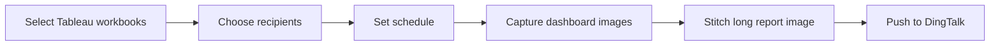
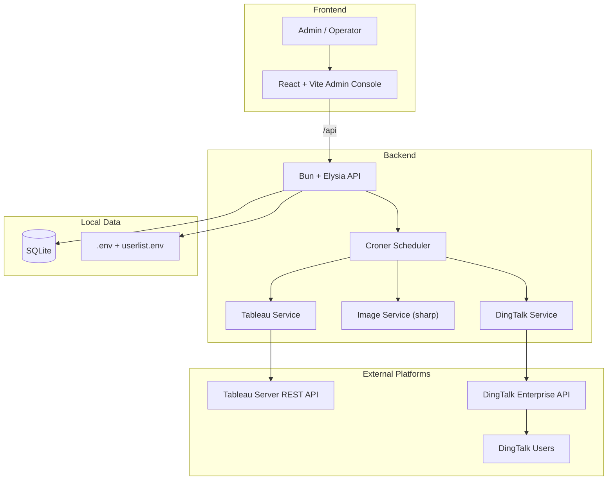
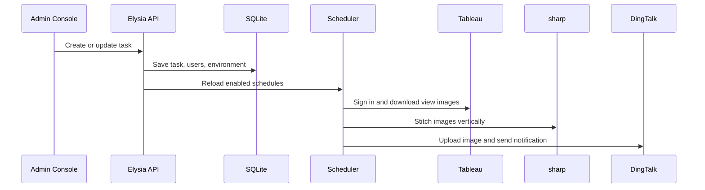
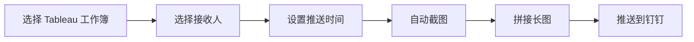
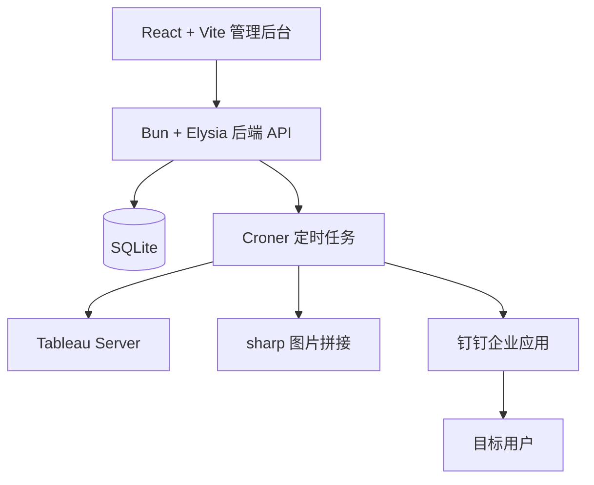

# Tableau Push Ding

**Automate Tableau screenshot delivery to DingTalk with a visual admin console.**


Tableau Push Ding helps teams turn Tableau dashboards into scheduled DingTalk work notifications. Operators use a web console to choose workbooks, recipients, environments, and delivery time; the backend captures Tableau views, stitches them into a readable long image, and sends the report through DingTalk.

[中文速览](#中文速览)

## Demo Story

| Before | After |
| --- | --- |
| Open Tableau every day | Schedule once in the admin console |
| Manually export dashboard screenshots | Backend captures high-resolution Tableau views |
| Combine multiple pages by hand | `sharp` stitches views into one long PNG |
| Send reports to each group manually | DingTalk sends work notifications automatically |
| Easy to mix test and production users | Environments and recipients are separated in SQLite |

## Product Flow



## What You Can Show in a Demo

| Screen / Moment | What to Point Out | Why It Sells |
| --- | --- | --- |
| Login | Simple admin entry point | Non-technical operators can use it |
| Task list | Existing schedules, enabled state, manual run | Reports become managed operations, not scripts |
| Create task | Workbook picker, recipients, cron builder | Business users configure delivery without code |
| User manager | Environment and branch/company assignment | Different teams receive the right report |
| DingTalk message | One long dashboard image in the chat | The final result arrives where people already work |

## Core Capabilities

| Capability | How it works | Value |
| --- | --- | --- |
| Visual admin console | React + Vite frontend calls `/api` | Easier task and user management |
| Tableau workbook discovery | Backend lists workbooks from Tableau REST API | Avoids manual workbook-name mistakes |
| Scheduled delivery | Croner loads enabled tasks from SQLite | Hands-free daily or weekly reporting |
| High-resolution capture | Downloads Tableau view images | Clean reports for mobile reading |
| Multi-view stitching | `sharp` vertically combines PNG buffers | One shareable long report image |
| DingTalk work notification | Uploads media and sends enterprise messages | Reports land directly in DingTalk |
| Environment isolation | `userlist.env` syncs test/prod credentials | Safer testing and production delivery |
| Branch-aware filtering | Adds Tableau filters such as `vf_filialeid=1009` | Users can receive branch-specific data |

## System Architecture



## Tech Stack

| Layer | Technology |
| --- | --- |
| Frontend | React, Vite, TypeScript, Tailwind CSS, lucide-react |
| Backend | Bun, Elysia, TypeScript |
| Database | SQLite via `bun:sqlite` |
| Scheduling | Croner |
| Tableau integration | Tableau REST API, `fast-xml-parser` |
| DingTalk integration | Access token, media upload, enterprise work notification API |
| Image processing | sharp |
| Deployment helpers | `start.sh`, `start.ps1`, `ecosystem.config.cjs` |

## Runtime Flow



## Project Structure

```text
.
|- index.ts                      # Backend entry and API routes
|- src/
|  |- db/db.ts                   # SQLite schema and seed data
|  |- services/                  # Tableau, DingTalk, image, scheduler, config services
|  '- utils/envParser.ts         # userlist.env parser
|- frontend/                     # React + Vite admin console
|- .env.example                  # Safe Tableau config template
|- userlist.example.env          # Safe DingTalk mapping template
|- start.sh                      # Linux/macOS startup script
|- start.ps1                     # Windows PowerShell startup script
'- ecosystem.config.cjs          # PM2 config
```

## Quick Start

```bash
bun install
cd frontend && bun install && cd ..
cp .env.example .env
cp userlist.example.env userlist.env
./start.sh
```

Default URLs:

| Service | URL |
| --- | --- |
| Frontend | `http://<server-ip>:5173` |
| Backend | `http://<server-ip>:3000` |

Windows:

```powershell
powershell -ExecutionPolicy Bypass -File .\start.ps1
```

PM2:

```bash
pm2 start ecosystem.config.cjs
pm2 logs
```

## Configuration

### `.env`

```env
TABLEAU_SERVER_URL=https://your-tableau-server
TABLEAU_SITE_ID=your-site-content-url
TABLEAU_TOKEN_NAME=your-personal-access-token-name
TABLEAU_TOKEN_VALUE=your-personal-access-token-secret
ADMIN_USERNAME=admin
ADMIN_PASSWORD=change-me
USERLIST_ENV_PATH=userlist.env
```

### `userlist.env`

```env
# 1. Test
DINGTALK_APP_KEY=your_test_app_key
DINGTALK_APP_SECRET=your_test_app_secret
DINGTALK_AGENT_ID=123456
DINGTALK_USER_ID=Alice:alice_userid,Bob:bob_userid

# 2. Production
DINGTALK_APP_KEY=your_prod_app_key
DINGTALK_APP_SECRET=your_prod_app_secret
DINGTALK_AGENT_ID=654321
DINGTALK_USER_ID=Carol:carol_userid,David:david_userid
```

## Main API Endpoints

| Method | Endpoint | Purpose |
| --- | --- | --- |
| `POST` | `/api/login` | Admin login |
| `GET` | `/api/environments` | List DingTalk environments |
| `GET` | `/api/filiales` | List branch/company units |
| `GET` | `/api/users` | List recipients |
| `POST` | `/api/users` | Create recipient |
| `PUT` | `/api/users/:id` | Update recipient |
| `GET` | `/api/workbooks` | Fetch Tableau workbooks |
| `GET` | `/api/tasks` | List report tasks |
| `POST` | `/api/tasks` | Create report task |
| `PUT` | `/api/tasks/:id` | Update report task |
| `POST` | `/api/tasks/:id/trigger` | Run a task immediately |

## Data Model

| Table | Stores |
| --- | --- |
| `admins` | Admin accounts and hashed passwords |
| `environments` | DingTalk app credentials |
| `filiales` | Branch/company units |
| `users` | DingTalk recipients and environment/branch mapping |
| `tasks` | Workbook selections, recipient IDs, cron rules, enabled state |

## Production Notes

| Topic | Recommendation |
| --- | --- |
| Secrets | Do not commit `.env`, `userlist.env`, SQLite files, or logs |
| Admin account | Replace the default password before production use |
| Network | Ensure the server can reach Tableau Server and DingTalk OpenAPI |
| Public access | Put the app behind HTTPS and a reverse proxy |
| Scheduling | Croner uses overlap protection for scheduled jobs |

## 中文速览

**Tableau Push Ding 是一个把 Tableau 看板自动推送到钉钉的报表分发系统。**

它适合演示成一句话：运营人员在网页里配置任务，系统定时截图 Tableau 看板，自动拼成长图，然后推送到指定钉钉用户。

## 演示重点

| 你展示什么 | 观众看到什么 | 价值 |
| --- | --- | --- |
| 任务列表 | 哪些报表在自动推送 | 报表分发变成可管理的系统 |
| 新建任务 | 选择工作簿、用户、环境、时间 | 不写代码也能配置推送 |
| 用户管理 | 用户绑定环境和分公司 | 不同团队收到不同数据 |
| 手动触发 | 立即运行一次任务 | 临时汇报也能快速推送 |
| 钉钉消息 | 一张可读的长图报表 | 结果直接到业务人员手里 |

## 中文流程图



## 中文架构图



## 中文快速启动

```bash
bun install
cd frontend && bun install && cd ..
cp .env.example .env
cp userlist.example.env userlist.env
./start.sh
```

| 地址 | 用途 |
| --- | --- |
| `http://<server-ip>:5173` | 前端管理台 |
| `http://<server-ip>:3000` | 后端 API |

## 许可证

AGPL-3.0-only. See [LICENSE](LICENSE).
