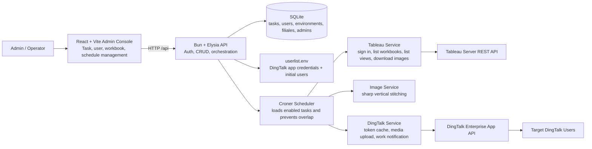
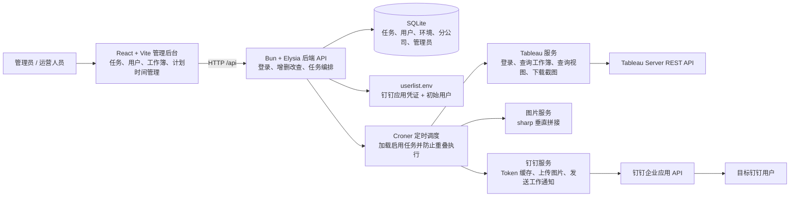

# Tableau Push Ding

**Automated Tableau report delivery for DingTalk teams.**

Tableau Push Ding turns Tableau dashboards into scheduled DingTalk work notifications. It fetches selected Tableau workbooks, downloads each workbook view as a high-resolution image, stitches multi-view dashboards into one readable long image, and sends the final report to the right DingTalk users automatically.

The project includes a web admin console, a Bun/Elysia backend API, a SQLite database, a cron scheduler, Tableau REST API integration, DingTalk enterprise-message delivery, and image processing powered by `sharp`.

[中文说明](#中文说明)

## Why It Matters

Business dashboards are only useful when people actually see them. Tableau Push Ding removes the repeated manual work of opening Tableau, exporting screenshots, combining dashboard pages, and sending them to different teams.

With this service, a non-technical operator can:

- Pick Tableau workbooks from a web interface.
- Choose recipients by environment and branch/company unit.
- Schedule reports using daily, workday, weekly, or custom cron rules.
- Trigger any report immediately when needed.
- Keep test and production DingTalk environments separated.
- Send branch-specific screenshots by applying Tableau view filters automatically.

## Key Features

- **Web admin console**: Manage report tasks, users, environments, workbooks, schedules, and manual delivery from a React + Vite frontend.
- **Tableau workbook discovery**: The backend connects to Tableau Server and lists available workbooks for task creation.
- **High-resolution screenshots**: Each Tableau view is downloaded through the Tableau REST API image endpoint.
- **Multi-view stitching**: Multiple screenshots from the same workbook are vertically stitched into one long PNG for easier reading in DingTalk.
- **DingTalk enterprise delivery**: Images are uploaded to DingTalk media storage and sent as work notifications through the enterprise app API.
- **Environment isolation**: Test and production DingTalk app credentials are synced from `userlist.env` into SQLite.
- **Recipient management**: Users are stored in SQLite and can be assigned to environments and branch/company units.
- **Branch-aware delivery**: Users can be grouped by `filiale_id`; the scheduler applies Tableau filters such as `vf_filialeid=<id>` before sending branch-specific images.
- **Overlap protection**: Croner prevents the same scheduled task from running on top of itself.
- **Simple deployment**: Runs with Bun, SQLite, and a single startup script. No external image-processing system package is required.

## Architecture



## How It Works

1. **Startup**
   - The backend initializes SQLite tables.
   - `userlist.env` is parsed and synced into `environments` and `users`.
   - Enabled tasks are loaded into the Croner scheduler.
   - The frontend is served by Vite and proxies `/api` requests to the backend.

2. **Task creation**
   - An admin logs into the web console.
   - The frontend calls `/api/workbooks` to fetch Tableau workbook options.
   - The admin selects workbooks, recipients, environment, and schedule.
   - The backend stores the task in SQLite and reloads the scheduler.

3. **Scheduled execution**
   - The scheduler finds the selected Tableau workbooks by name.
   - For each workbook, it loads all views and downloads high-resolution screenshots.
   - Recipients are grouped by branch/company unit. When a branch ID exists, Tableau image requests include a view filter such as `vf_filialeid=1632`.
   - Screenshots are stitched into one PNG.
   - The PNG is uploaded to DingTalk and sent to the selected users as a work notification.

## Tech Stack

| Layer | Technology |
| --- | --- |
| Runtime | Bun |
| Backend API | Elysia |
| Frontend | React, Vite, TypeScript |
| Styling/UI | Tailwind CSS, lucide-react |
| Database | SQLite via `bun:sqlite` |
| Scheduling | Croner |
| Tableau integration | Tableau REST API, XML parsing with `fast-xml-parser` |
| DingTalk integration | DingTalk OAuth token, media upload, enterprise work notification API |
| Image processing | sharp |
| Process management | `start.sh` or PM2 `ecosystem.config.cjs` |

## Project Structure

```text
.
├── index.ts                         # Backend entry point and API routes
├── src/
│   ├── db/db.ts                     # SQLite schema and seed data
│   ├── services/configService.ts    # Sync userlist.env into SQLite
│   ├── services/tableauService.ts   # Tableau auth, workbook/view lookup, image download
│   ├── services/imageService.ts     # Screenshot stitching with sharp
│   ├── services/dingtalkService.ts  # DingTalk token, media upload, message sending
│   ├── services/schedulerService.ts # Cron loading and task execution
│   └── utils/envParser.ts           # Custom parser for userlist.env
├── frontend/
│   ├── src/App.tsx                  # Admin console shell
│   ├── src/components/              # Task, user, login, toast, modal components
│   └── vite.config.ts               # Vite proxy for /api -> localhost:3000
├── userlist.env                     # DingTalk environments and initial users
├── tableau_push.sqlite              # Local SQLite database
├── start.sh                         # Start backend and frontend together
└── ecosystem.config.cjs             # PM2 process configuration
```

## Requirements

- Bun 1.x or later
- A Tableau Server personal access token
- A DingTalk enterprise app with `appKey`, `appSecret`, and `agentId`
- Network access from the server to Tableau Server and DingTalk OpenAPI

## Configuration

### `.env`

The backend reads Tableau connection settings from `.env` or process environment variables:

```env
TABLEAU_SERVER_URL=https://your-tableau-server
TABLEAU_SITE_ID=your-site-content-url
TABLEAU_TOKEN_NAME=your-personal-access-token-name
TABLEAU_TOKEN_VALUE=your-personal-access-token-secret
```

`TABLEAU_SITE_ID` can be empty for the default Tableau site.

### `userlist.env`

DingTalk environments and initial users are read from `userlist.env`. The parser expects section headers like `# 1、测试环境` and key-value pairs inside each section.

```env
# 1、测试环境
DINGTALK_APP_KEY=your_test_app_key
DINGTALK_APP_SECRET=your_test_app_secret
DINGTALK_AGENT_ID=123456
DINGTALK_USER_ID=Alice:alice_userid,Bob:bob_userid

# 2、正式环境
DINGTALK_APP_KEY=your_prod_app_key
DINGTALK_APP_SECRET=your_prod_app_secret
DINGTALK_AGENT_ID=654321
DINGTALK_USER_ID=Carol:carol_userid,David:david_userid
```

On startup, the backend upserts environments and users into SQLite. Later user changes can be managed from the web console.

## Run Locally or on a VPS

Install dependencies:

```bash
bun install
cd frontend && bun install && cd ..
```

Start backend and frontend together:

```bash
./start.sh
```

Default URLs:

- Frontend: `http://<server-ip>:5173`
- Backend: `http://<server-ip>:3000`

The Vite frontend proxies `/api` to `http://localhost:3000`.

### PM2

The repository also includes `ecosystem.config.cjs`:

```bash
pm2 start ecosystem.config.cjs
pm2 logs
```

## Default Login

On first startup, the database seeds a default admin account:

```text
username: admin
password: admin123
```

Change this credential before using the service in production.

## Main API Endpoints

| Method | Endpoint | Purpose |
| --- | --- | --- |
| `POST` | `/api/login` | Admin login |
| `GET` | `/api/environments` | List DingTalk environments |
| `GET` | `/api/filiales` | List branch/company units |
| `GET` | `/api/users` | List recipients |
| `POST` | `/api/users` | Create recipient |
| `PUT` | `/api/users/:id` | Update recipient |
| `DELETE` | `/api/users/:id` | Delete recipient |
| `GET` | `/api/workbooks` | Fetch Tableau workbooks in real time |
| `GET` | `/api/tasks` | List report tasks |
| `POST` | `/api/tasks` | Create report task |
| `PUT` | `/api/tasks/:id` | Update report task |
| `DELETE` | `/api/tasks/:id` | Delete report task |
| `POST` | `/api/tasks/:id/trigger` | Trigger a task immediately |

## Database Tables

| Table | Description |
| --- | --- |
| `admins` | Admin login accounts with hashed passwords |
| `environments` | DingTalk app credentials for test/production or other environments |
| `filiales` | Branch/company units used for recipient grouping and Tableau filtering |
| `users` | DingTalk recipients, linked to an environment and optionally a branch |
| `tasks` | Scheduled report jobs, selected workbooks, target users, cron rule, enabled flag |

## Operational Notes

- Task schedules use standard cron expressions handled by Croner.
- The scheduler reloads all tasks after task create/update/delete operations.
- `protect: true` is enabled in Croner to avoid overlapping runs of the same task.
- DingTalk access tokens are cached per app key and refreshed before expiration.
- DingTalk recipients are sent in chunks of up to 100 users.
- Tableau authentication is retried once when the service receives a `401` response.
- Tableau image filters are currently generated with the `vf_` prefix, for example `vf_filialeid=1009`.

## Security Notes

- Do not commit `.env`, `userlist.env`, or `tableau_push.sqlite` to a public repository.
- Replace the default admin password before production use.
- Restrict VPS firewall access to the frontend and backend ports as needed.
- Use HTTPS and a reverse proxy for public deployment.

## 中文说明

# Tableau Push Ding

**把 Tableau 看板自动推送到钉钉的报表机器人。**

Tableau Push Ding 可以定时从 Tableau Server 获取指定工作簿，下载工作簿下的多个视图截图，把多页看板拼接成一张长图，然后通过钉钉企业应用推送给指定用户。

它不仅是一个脚本，而是一个带 Web 管理台的完整小系统：前端负责配置任务、用户和计划时间；后端负责连接 Tableau、处理图片、管理定时任务，并调用钉钉接口完成推送。

## 适合解决什么问题

很多团队每天都要重复做这些事：打开 Tableau、找到对应看板、截图、拼图、发到钉钉、提醒不同团队查看。这个项目把这套流程自动化，让业务人员不用每天手动搬运报表。

使用这个系统后，你可以：

- 在网页里选择 Tableau 工作簿。
- 给不同环境、不同分公司配置接收人。
- 设置每天、工作日、每周或自定义 cron 推送时间。
- 临时手动触发任意报表任务。
- 区分测试环境和正式环境的钉钉应用。
- 按分公司自动给 Tableau 截图加过滤条件，再分别推送。

## 核心卖点

- **可视化管理后台**：通过 React + Vite 前端管理任务、用户、工作簿、计划时间和手动触发。
- **自动读取 Tableau 工作簿**：创建任务时直接从 Tableau Server 拉取可选工作簿，减少手动填写错误。
- **高清截图**：使用 Tableau REST API 获取高分辨率视图图片。
- **自动拼接长图**：一个工作簿有多个视图时，系统会用 `sharp` 垂直拼接成一张长图，方便在钉钉里阅读。
- **钉钉工作通知**：图片上传到钉钉后，通过企业应用工作通知发送给指定用户。
- **测试/正式环境隔离**：从 `userlist.env` 同步不同钉钉环境的应用凭证和初始用户。
- **用户与分公司管理**：用户存入 SQLite，可绑定环境和分公司。
- **按分公司推送不同截图**：用户按 `filiale_id` 分组，截图时自动带上 Tableau 过滤参数，例如 `vf_filialeid=1632`。
- **防重复执行**：Croner 开启重叠保护，避免同一个任务还没跑完又被再次触发。
- **部署简单**：Bun + SQLite + `start.sh` 即可运行，不依赖系统级图片处理工具。

## 架构图



## 工作流程

1. **系统启动**
   - 后端初始化 SQLite 数据表。
   - 解析 `userlist.env`，同步钉钉环境和初始用户。
   - 读取已启用任务并注册到 Croner 定时器。
   - 前端通过 Vite 启动，并把 `/api` 请求代理到后端。

2. **创建任务**
   - 管理员登录 Web 管理台。
   - 前端调用 `/api/workbooks` 实时获取 Tableau 工作簿列表。
   - 管理员选择工作簿、接收人、环境和定时时间。
   - 后端把任务保存到 SQLite，并重新加载定时任务。

3. **任务执行**
   - 定时器根据任务配置找到对应的 Tableau 工作簿。
   - 系统读取工作簿下所有视图，并下载高清截图。
   - 接收人按分公司分组；如果用户绑定了分公司，截图请求会自动加上类似 `vf_filialeid=1632` 的 Tableau 过滤条件。
   - 多张截图用 `sharp` 拼接成一张 PNG 长图。
   - 图片上传到钉钉，再通过企业应用工作通知发送给对应用户。

## 技术栈

| 层级 | 技术 |
| --- | --- |
| 运行时 | Bun |
| 后端 API | Elysia |
| 前端 | React, Vite, TypeScript |
| UI | Tailwind CSS, lucide-react |
| 数据库 | SQLite, `bun:sqlite` |
| 定时任务 | Croner |
| Tableau 集成 | Tableau REST API, `fast-xml-parser` |
| 钉钉集成 | 钉钉 AccessToken、媒体上传、企业工作通知 API |
| 图片处理 | sharp |
| 进程管理 | `start.sh` 或 PM2 `ecosystem.config.cjs` |

## 目录结构

```text
.
├── index.ts                         # 后端入口和 API 路由
├── src/
│   ├── db/db.ts                     # SQLite 表结构和初始化数据
│   ├── services/configService.ts    # 把 userlist.env 同步到 SQLite
│   ├── services/tableauService.ts   # Tableau 登录、工作簿/视图查询、截图下载
│   ├── services/imageService.ts     # 使用 sharp 拼接截图
│   ├── services/dingtalkService.ts  # 钉钉 Token、上传图片、发送消息
│   ├── services/schedulerService.ts # 定时任务加载和执行
│   └── utils/envParser.ts           # userlist.env 自定义解析器
├── frontend/
│   ├── src/App.tsx                  # 管理后台主界面
│   ├── src/components/              # 任务、用户、登录、弹窗、提示组件
│   └── vite.config.ts               # /api 代理到 localhost:3000
├── userlist.env                     # 钉钉环境和初始用户
├── tableau_push.sqlite              # 本地 SQLite 数据库
├── start.sh                         # 同时启动前后端
└── ecosystem.config.cjs             # PM2 配置
```

## 运行要求

- Bun 1.x 或更高版本
- Tableau Server 个人访问令牌
- 钉钉企业应用的 `appKey`、`appSecret`、`agentId`
- 服务器可以访问 Tableau Server 和钉钉 OpenAPI

## 配置说明

### `.env`

后端从 `.env` 或系统环境变量读取 Tableau 配置：

```env
TABLEAU_SERVER_URL=https://your-tableau-server
TABLEAU_SITE_ID=your-site-content-url
TABLEAU_TOKEN_NAME=your-personal-access-token-name
TABLEAU_TOKEN_VALUE=your-personal-access-token-secret
```

如果使用 Tableau 默认站点，`TABLEAU_SITE_ID` 可以留空。

### `userlist.env`

钉钉环境和初始用户从 `userlist.env` 读取。解析器会识别类似 `# 1、测试环境` 的分段标题。

```env
# 1、测试环境
DINGTALK_APP_KEY=your_test_app_key
DINGTALK_APP_SECRET=your_test_app_secret
DINGTALK_AGENT_ID=123456
DINGTALK_USER_ID=张三:zhangsan_userid,李四:lisi_userid

# 2、正式环境
DINGTALK_APP_KEY=your_prod_app_key
DINGTALK_APP_SECRET=your_prod_app_secret
DINGTALK_AGENT_ID=654321
DINGTALK_USER_ID=王五:wangwu_userid,赵六:zhaoliu_userid
```

系统启动时会把这些环境和用户写入 SQLite。后续新增或修改用户，可以直接在 Web 管理台操作。

## 启动方式

安装依赖：

```bash
bun install
cd frontend && bun install && cd ..
```

同时启动后端和前端：

```bash
./start.sh
```

默认访问地址：

- 前端：`http://<server-ip>:5173`
- 后端：`http://<server-ip>:3000`

Vite 前端会把 `/api` 请求代理到 `http://localhost:3000`。

### 使用 PM2

仓库里也提供了 `ecosystem.config.cjs`：

```bash
pm2 start ecosystem.config.cjs
pm2 logs
```

## 默认登录账号

首次启动时，数据库会初始化一个默认管理员：

```text
username: admin
password: admin123
```

正式使用前请修改默认密码。

## 主要接口

| 方法 | 接口 | 作用 |
| --- | --- | --- |
| `POST` | `/api/login` | 管理员登录 |
| `GET` | `/api/environments` | 获取钉钉环境 |
| `GET` | `/api/filiales` | 获取分公司列表 |
| `GET` | `/api/users` | 获取接收人列表 |
| `POST` | `/api/users` | 新增接收人 |
| `PUT` | `/api/users/:id` | 更新接收人 |
| `DELETE` | `/api/users/:id` | 删除接收人 |
| `GET` | `/api/workbooks` | 实时获取 Tableau 工作簿 |
| `GET` | `/api/tasks` | 获取报表任务 |
| `POST` | `/api/tasks` | 创建报表任务 |
| `PUT` | `/api/tasks/:id` | 更新报表任务 |
| `DELETE` | `/api/tasks/:id` | 删除报表任务 |
| `POST` | `/api/tasks/:id/trigger` | 立即触发任务 |

## 数据表说明

| 表 | 说明 |
| --- | --- |
| `admins` | 管理员账号，密码使用哈希存储 |
| `environments` | 钉钉应用环境，例如测试环境、正式环境 |
| `filiales` | 分公司或业务单元，用于用户分组和 Tableau 过滤 |
| `users` | 钉钉接收人，关联环境，可选关联分公司 |
| `tasks` | 定时报表任务，包含工作簿、接收人、cron、启用状态等 |

## 运维提示

- 定时时间使用标准 cron 表达式，由 Croner 执行。
- 新增、修改、删除任务后，后端会自动重新加载定时任务。
- Croner 开启了 `protect: true`，避免同一个任务重叠执行。
- 钉钉 AccessToken 会按 app key 缓存，并在过期前刷新。
- 钉钉接收人会按每批最多 100 人分批发送。
- Tableau 返回 `401` 时，服务会重新登录并重试一次。
- Tableau 截图过滤参数当前使用 `vf_` 前缀，例如 `vf_filialeid=1009`。

## 安全建议

- 不要把 `.env`、`userlist.env`、`tableau_push.sqlite` 提交到公开仓库。
- 正式使用前修改默认管理员密码。
- 按需限制 VPS 防火墙开放的前后端端口。
- 对公网部署时建议使用 HTTPS 和反向代理。
